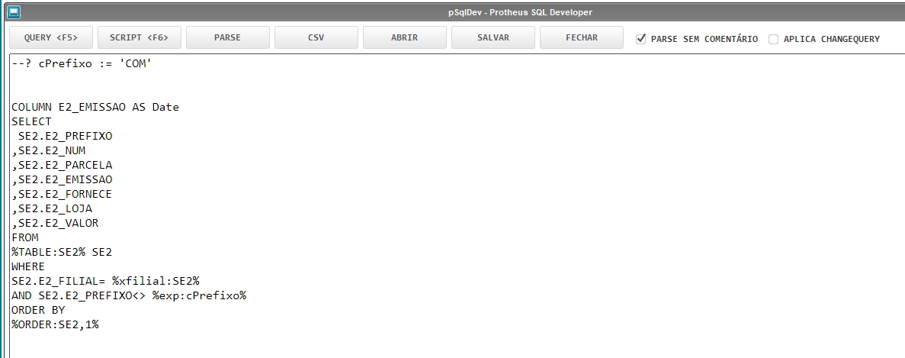

# pSqlDev - Protheus Sql Developer

## Objetivo

Execute consultas e manipule o banco de dados do protheus através de instruções SQL e apresenta os seguintes recursos:

* Salva a última query executada.
* Permite a utilização de comentários.
* Executa o trecho selecionado da query.
* Manipule os dados do banco de dados com DML ( INSERT, UPDATE E DELETE ).
* Use o Advpl Embedded SQL e capture a query executada pelo banco.
* Criação de variável em tempo de execução.
* Permite o uso dos valores informados em uma pergunta (SX1).
* Converta o tipo de dados com recuros do Embedded SQL.
* Utilize o o Index Order do Embedded SQL

[Veja demonstração no Youtube](https://youtu.be/xXAa8GsNk5o)
